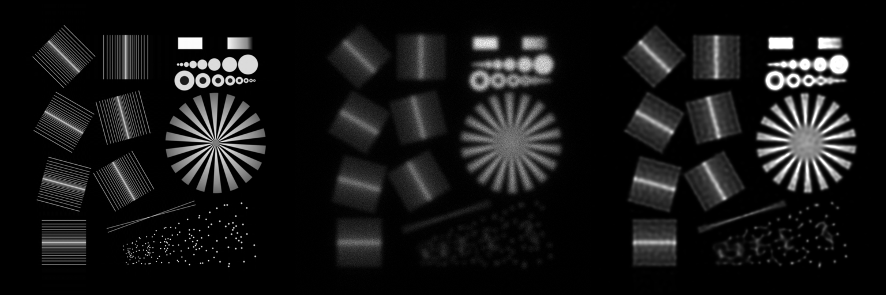

# DeconvOptim.jl

<br>
<a name="logo"/>
<div align="left">
<a href="https://roflmaostc.github.io/DeconvOptim.jl/stable/" target="_blank">
</img>
</a>
</div>
<br>
A package for microscopy image based deconvolution via Optim.jl. This package works with N dimensional Point Spread Functions and images.
The package was created with microscopy in mind but since the code base is quite general it is possible to deconvolve different kernels as well. 

We would be happy to deconvolve *real* data! File an issue if we can help deconvolving an image/stack. We would be also excited to adapt DeconvOptim.jl to your special needs!
<br>

| **Documentation**                       | **Build Status**                          | **Code Coverage**               |
|:---------------------------------------:|:-----------------------------------------:|:-------------------------------:|
| [![][docs-stable-img]][docs-stable-url] [![][docs-dev-img]][docs-dev-url] | [![][CI-img]][CI-url] | [![][codecov-img]][codecov-url] |


## Installation
Type `]`in the REPL to get to the package manager:
```julia
julia> ] add DeconvOptim
```

## Documentation
The documentation of the latest release is [here](docs-stable-url).
The documentation of current master is [here](docs-dev-url).
For a quick introduction you can also watch the presentation at the JuliaCon 2021.

<a  href="https://www.youtube.com/watch?v=FodpnOhccis"></a>

## Usage
A quick example is shown below.
```julia
using DeconvOptim, TestImages, Colors, ImageIO, Noise, ImageShow

# load test image
img = Float32.(testimage("resolution_test_512"))

# generate simple Point Spread Function of aperture radius 30
psf = Float32.(generate_psf(size(img), 30))

# create a blurred, noisy version of that image
img_b = conv(img, psf)
img_n = poisson(img_b, 300)

# deconvolve 2D with default options
@time res, o = deconvolution(img_n, psf)

# deconvolve 2D with no regularizer
@time res_no_reg, o = deconvolution(img_n, psf, regularizer=nothing)

# show final results next to original and blurred version
Gray.([img img_n res])
```


## Examples
Have a quick look into the [examples folder](examples).
We demonstrate the effect of different regularizers. There is also a [CUDA example](examples/cuda_2D.ipynb). 
Using regularizers together with a CUDA GPU is faster but unfortunately only a factor of ~5-10.
For [3D](examples/cuda_3D.ipynb) the speed-up is larger.

## CUDA
For CUDA we only provide a Total variation regularizer via `TV_cuda`. The reason is that Tullio.jl is currently not very fast with `CuArray`s and especially
the derivative of such functions.

## Performance Tips
### Regularizers
The regularizers are generated with metaprogramming when `TV()` (or any other regularizer) is called. To prevent that the code
compile every time again, define the regularizer once and use it multiple times without newly defining it:
```julia
reg = TV()
```
And in the new cell then use:
```julia
res, o = deconvolution(img_n, psf, regularizer=reg)
```


## Contributions
I would like to thank [Rainer Heintzmann](https://nanoimaging.de/) for the great support and discussions during development.
Furthermore without [Tullio.jl](https://github.com/mcabbott/Tullio.jl) and [@mcabbott](https://github.com/mcabbott/) this package wouldn't be as fast as it is. His package and ideas are the basis for the implementations of the regularizers.


[docs-dev-img]: https://img.shields.io/badge/docs-dev-orange.svg 
[docs-dev-url]: https://roflmaostc.github.io/DeconvOptim.jl/dev/ 

[docs-stable-img]: https://img.shields.io/badge/docs-stable-blue.svg 
[docs-stable-url]: https://roflmaostc.github.io/DeconvOptim.jl/stable/

[codecov-img]: https://codecov.io/gh/roflmaostc/DeconvOptim.jl/branch/master/graph/badge.svg
[codecov-url]: https://codecov.io/gh/roflmaostc/DeconvOptim.jl

[CI-img]: https://github.com/roflmaostc/DeconvOptim.jl/workflows/CI/badge.svg
[CI-url]: https://github.com/roflmaostc/DeconvOptim.jl/actions?query=workflow%3ACI 
