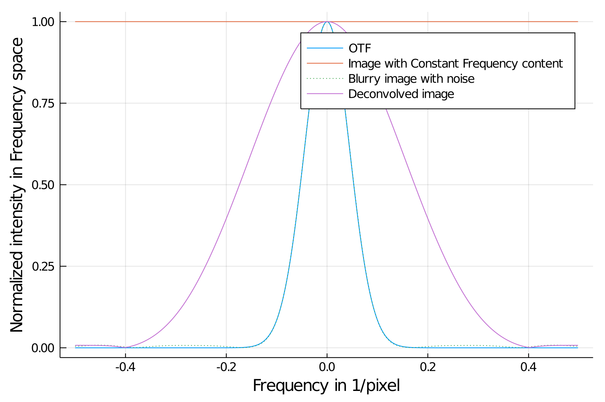

# Physical Background
We want to provide some physical background to the process of deconvolution in optics.
Optical systems like microscopes can only collect a certain amount of light emitted by a specimen. This effects leads to a blurred image of that specimen.
Mathematically the lens has a certain frequency support. Within that frequency transmission of light is supported.
Light outside of this frequency support (equivalent to high frequency information) is lost.
In the following picture we can see several curves in the frequency domain. 
The orange line is a artificial object with a constant frequency spectrum (delta peak).
If such a delta peak is transferred through an optical lens, in real space the object is convolved with the point spread function (PSF). 
In frequency space such a convolution is a multiplication of the OTF (OTF is the Fourier transform of the PSF) and the frequency spectrum of the object.
The green curve is the captured image after transmission through the system. Additionally some noise was introduced which can be recognized through some bumps outside of the
OTF support.

## Forward Model 

Mathematically an ideal imaging process of specimen emitting incoherent light by a lens (or any optical system in general) can be described as:

$Y(r) = (S * \text{PSF})(r)$

where $*$ being a convolution, $r$ being the position, $S$ being the sample and $\text{PSF}$ being the point spread function of the system.
In frequency space the equation is:

$\tilde Y(k) = (\tilde S * \tilde{\text{PSF}})(k)$

where $k$ is the spatial frequency. From that equation it is clear why the green and blue line in the plot look very similar. The reason is, that the orange line is constant and we basically multiply the OTF with the orange line. 

## Noise Model
However, the physical description (forward model) should also contain a noise term to reflect the measurement process in reality more accurately. 

$Y(r) = (S * \text{PSF})(r) + N(r) = \mu(r) + N(r)$

where $N$ being a noise term.
In fluorescence microscopy the dominant noise is usually *Poisson shot noise* (see [Mertz:2019](@cite)).
The origin of that noise is the quantum nature of photons. Since the measurement process spans over a time T only a discrete number of photons is detected (in real experiment the amount of photons per pixel is usually in the range of several hundred). Note that this noise is not introduced by the sensor and is just a effect due to quantum nature of light. 
We can interprete every sensor pixel as a discrete random variable $X$. The expected value of that pixel would be $\mu(r)$ (true specimen convolved with the $\text{PSF})$. Due to noise, the systems measures randomly a signal for $X$ according to the Poisson distribution:

$f(y, \mu) = \frac{\mu^y \exp(-\mu)}{\Gamma(y + 1)}$

where $f$ is the probability density distribution, $y$ the measured value of the sensor, $\mu$ the expected value and $\Gamma$ the generalized factorial function.
