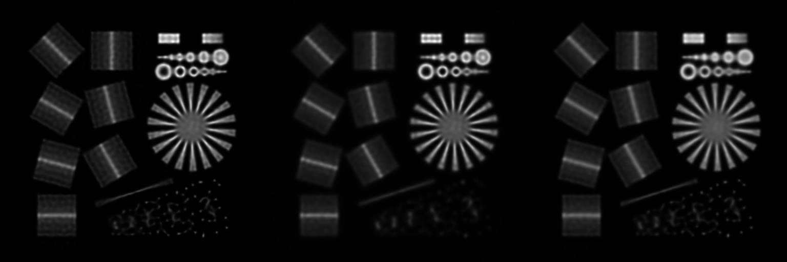

# Changing Loss Function

We can also change the loss function. However, the loss is the most important part guaranteeing good results. Therefore choosing different loss functions than the 
provided ones, will most likely to worse results.
We try all implemented loss functions of DeconvOptim.jl.
However, we could also include loss functions of Flux.jl since they have the same interface.

`Poisson()` will most likely produce the best results in presence of Poisson Noise. For Gaussian Noise, `Gauss()` is a suitable option.
`ScaledGaussian()` is mathematical an approximation of `Poisson()`.


## Code Example

```@jldoctest
using Revise, DeconvOptim, TestImages, Images, FFTW, Noise, ImageView

# custom image views
imshow_m(args...) = imshow(cat(args..., dims=3))
h_view(args...) = begin
    img = cat(args..., dims=2)
    img ./= maximum(img)
    colorview(Gray, img)
end

# load test images
img = 300 .* convert(Array{Float32}, channelview(testimage("resolution_test_512")))

psf = generate_psf(size(img), 30)

# create a blurred, noisy version of that image
img_b = conv_psf(img, psf, [1, 2])
img_n = poisson(img_b, 300);

i@time resP, optim_res = deconvolution(img_n, psf, loss=Poisson(), iterations=10)
@show optim_res

@time resG, optim_res = deconvolution(img_n, psf, loss=Gauss(), iterations=10)
@show optim_res

@time resSG, optim_res = deconvolution(img_n, psf, loss=ScaledGauss(), iterations=10)
@show optim_res

h_view(resP, resG, resSG)
```

The left image is `Poisson()`, in the middle `Gauss()`. The right image is `ScaledGauss()`.

