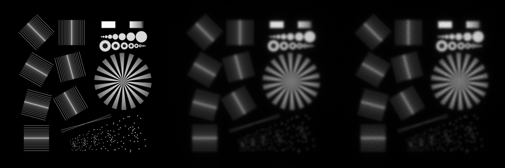

# Changing Regularizers 
Load the required modules for these examples:
```@jldoctest
using DeconvOptim, TestImages, Images, FFTW, Noise, ImageView

# custom image views
imshow_m(args...) = imshow(cat(args..., dims=3))
h_view(args...) = begin
    img = cat(args..., dims=2)
    img ./= maximum(img)
    colorview(Gray, img)
end
```

As the next step we can prepare a noisy, blurred image. The scaling of `img_n` is chosen in such a way,  that the highest pixel corresponds to the number of photons measured.
The algorithm does not depend critically on that number.
However, choosing maximum intensity values of 10 usually introduces some artifacts.

```@jldoctest
# load test images
img = 300 .* convert(Array{Float32}, channelview(testimage("resolution_test_512")))

psf = generate_psf(size(img), 30)

# create a blurred, noisy version of that image
img_b = conv_psf(img, psf, [1, 2])
img_n = poisson(img_b, 300);

h_view(img, img_b, img_n)
```



## Let's test Good's roughness (GR)
In this part we can look at the results produced with a GR regularizer. After inspecting the results, it becomes clear, that the benefit of 100 iterations is not really visible.
In most cases $\approx 15$ produce good results. By executing `GR()` we in fact create
```jldoctest
@time resGR100, optim_res = deconvolution(img_n, psf, regularizer=GR(), iterations=100)
@show optim_res

@time resGR15, optim_res = deconvolution(img_n, psf, regularizer=GR(), iterations=15)
@show optim_res

@time resGR15_2, optim_res = deconvolution(img_n, psf, λ=0.05, regularizer=GR(), iterations=15)
@show optim_res

h_view(img_n, resGR100, resGR15, resGR15_2)
```


## Let's test Total Variation (TV)
TV produces characteristic staircase artifacts. However, the results it produces are usually noise free and clear.
```@jldoctest
@time resTV50, optim_res = deconvolution(img_n, psf, regularizer=TV(), iterations=50)
@show optim_res

@time resTV15, optim_res = deconvolution(img_n, psf, regularizer=TV(), iterations=15)
@show optim_res

@time resTV15_2, optim_res = deconvolution(img_n, psf, λ=0.005, regularizer=TV(), iterations=15)
@show optim_res

h_view(img_n, resTV50, resTV15, resTV15_2)
```


## Let's test Tikhonov

```@jldoctest
@time resTik1, optim_res = deconvolution(img_n, psf, λ=0.001, regularizer=Tikhonov(), iterations=15)
@show optim_res


@time resTik2, optim_res = deconvolution(img_n, psf, λ=0.0001, 
                    regularizer=Tikhonov(mode="spatial_grad_square"), iterations=15)
@show optim_res

@time resTik3, optim_res = deconvolution(img_n, psf, λ=0.0001, 
    regularizer=Tikhonov(mode="identity"), iterations=15)
@show optim_res

h_view(img_n, resTik1, resTik2, resTik3)
```


## Let's test without regularizers

```
@jldoctest
@time res100, optim_res = deconvolution(img_n, psf, regularizer=nothing, iterations=50)
@show optim_res

@time res15, optim_res = deconvolution(img_n, psf, regularizer=nothing, iterations=15)
@show optim_res

h_view(img_n, 0.7 .* res100, res15)
```

